# Build Beautiful GUIs with Python (PyGObject) and GTK

 and GTK")

- [🇺🇸](./README.md)
- [🇧🇷](./README-pt_BR.md)

## ✨ About This Project

This repository is your complete guide to building sleek, modern graphical user interfaces with Python (PyGObject) and GTK. Whether you're a beginner or an experienced developer, you'll find practical tutorials, tips, and real code examples to level up your projects.

If this content has helped you, please consider making a donation. Your support makes a real difference and helps the project grow! 💙

## 🛠 Technologies Used

## 👨‍💻 Author

Crafted with 💙 by Renato Cruz. Got questions or feedback? Reach out anytime!

What I'm listening to while I code or study 😎🎵:

## 💝 Support This Project

Your donation keeps this project alive and helps me continue creating and sharing useful content.

### GitHub Sponsors

[https://github.com/sponsors/natorsc/](https://github.com/sponsors/natorsc/)

### Pix (Brazil)

`b1839493-2afe-484d-9272-82a3e402b36f`

---

## 💡 Extra

### GTK

- [Documentation GTK 3](https://docs.gtk.org/gtk3/).
- [Documentation GTK 4](https://docs.gtk.org/gtk4/).

### Libadwaita

- [Documentation 1.x](https://gnome.pages.gitlab.gnome.org/libadwaita/doc/1-latest/).

### GNOME

- [Official website](https://www.gnome.org/).
- [Blog](https://blogs.gnome.org/).
- [GNOME Human Interface Guidelines (HIG)](https://wiki.gnome.org/Design/HIG).

### Development

- [GNOME Builder](https://apps.gnome.org/pt-BR/app/org.gnome.Builder/).
- [Workbench](https://apps.gnome.org/pt-BR/app/re.sonny.Workbench/).
- [Cambalache](https://flathub.org/pt-BR/apps/ar.xjuan.Cambalache).
- [Icon Library](https://flathub.org/apps/details/org.gnome.design.IconLibrary).
- [Typography](https://flathub.org/apps/details/org.gnome.design.Typography).
- [App Icon Preview](https://flathub.org/apps/details/org.gnome.design.AppIconPreview).
- [Symbolic Preview](https://flathub.org/apps/details/org.gnome.design.SymbolicPreview).
- [Color Palette](https://flathub.org/apps/details/org.gnome.design.Palette).
- [Gnome icon library online](https://teams.pages.gitlab.gnome.org/Design/icon-development-kit-www/).

### Softwares

- [GNOME Apps](https://apps.gnome.org/pt-BR/).
- [GNOME circle](https://circle.gnome.org/).
- [Awesome GTK](https://github.com/valpackett/awesome-gtk).

### Flatpak

- [Official website](https://www.flatpak.org/).
- [Flathub](https://flathub.org/).

### Visual Studio Code

- [Gnome Magic (bedsteler20)](https://marketplace.visualstudio.com/items?itemName=bedsteler20.gnome-magic).
- [GTK Blueprint (Bodil Stokke)](https://marketplace.visualstudio.com/items?itemName=bodil.blueprint-gtk).
- [Flatpak (Bilal Elmoussaoui)](https://marketplace.visualstudio.com/items?itemName=bilelmoussaoui.flatpak-vscode).

---

## Widgets

### GTK

#### Gtk.ActionBar

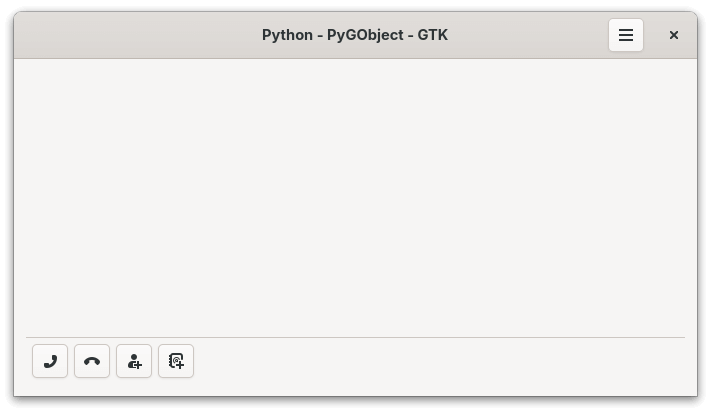

- [Python](./src/gtk-widgets/actionbar/MainWindow.py).
- [GTK Blueprint](./src/gtk-widgets/actionbar/ui/MainWindow.blp).

---

#### Gtk.ApplicationWindow

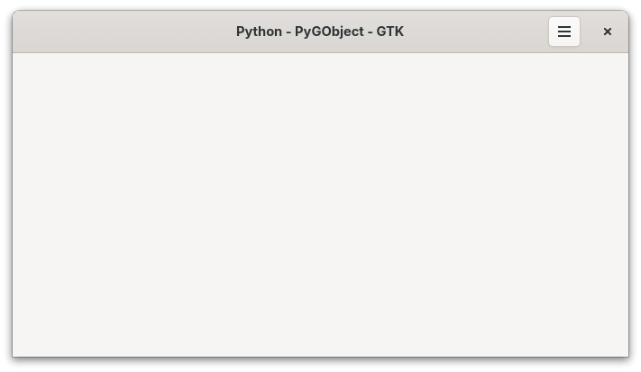

- [Python](./src/gtk-widgets/application-window/MainWindow.py).
- [GTK Blueprint](./src/gtk-widgets/application-window/ui).

---

#### Gtk.Box (horizontal)

")

- [Python](./src/gtk-widgets/box-horizontal/MainWindow.py).
- [GTK Blueprint](./src/gtk-widgets/box-horizontal/ui).

---

#### Gtk.Box (vertical)

")

- [Python](./src/gtk-widgets/box-vertical/MainWindow.py).
- [GTK Blueprint](./src/gtk-widgets/box-vertical/ui).

---

#### Gtk.Button

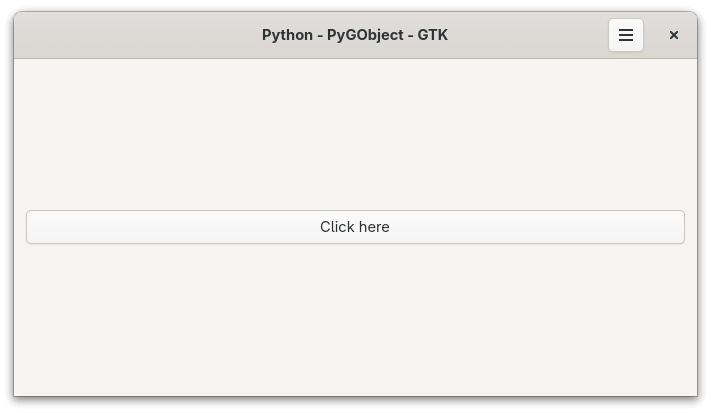

- [Python](./src/gtk-widgets/button/MainWindow.py).
- [GTK Blueprint](./src/gtk-widgets/button/ui).

---

#### Gtk.Calendar

- [Python](./src/gtk-widgets/calendar/MainWindow.py).
- [GTK Blueprint](./src/gtk-widgets/calendar/ui).

---

#### Gtk.CheckButton

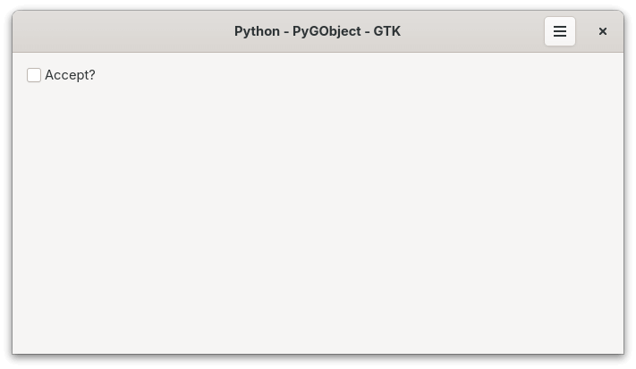

- [Python](./src/gtk-widgets/check-button/MainWindow.py).
- [GTK Blueprint](./src/gtk-widgets/check-button/ui).

---

#### Gtk.CheckButton (radio)

")

- [Python](./src/gtk-widgets/check-button-radio/MainWindow.py).
- [GTK Blueprint](./src/gtk-widgets/check-button-radio/ui).

---

#### Gtk.ColorDialogButton

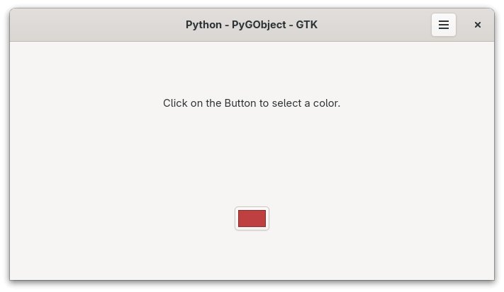

- [Python](./src/gtk-widgets/color-dialog-button/MainWindow.py).
- [GTK Blueprint](./src/gtk-widgets/color-dialog-button/ui).

---

#### Gtk.CssProvider

- [Python](./src/gtk-widgets/css-provider/MainWindow.py).
- [GTK Blueprint](./src/gtk-widgets/css-provider/ui).

---

#### Gtk drag and drop data

- [Python](./src/gtk-widgets/drag-and-drop-data/MainWindow.py).
- [GTK Blueprint](./src/gtk-widgets/drag-and-drop-data/ui).

---

#### Gtk drag and drop widget

- [Python](./src/gtk-widgets/drag-and-drop-widget/MainWindow.py).
- [GTK Blueprint](./src/gtk-widgets/drag-and-drop-widget/ui).

---

#### Gtk.DropDown

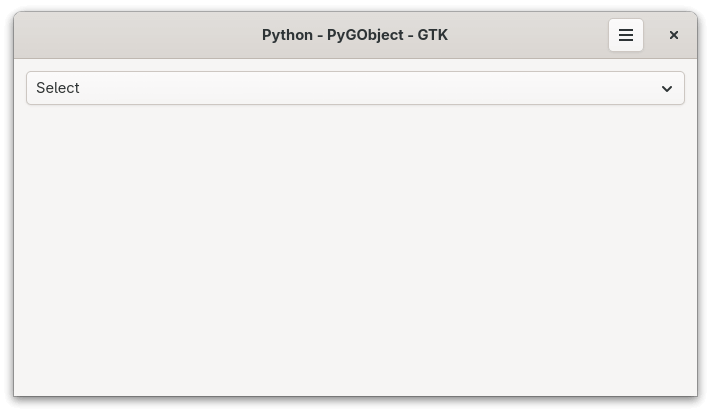

- [Python](./src/gtk-widgets/drop-down/MainWindow.py).
- [GTK Blueprint](./src/gtk-widgets/drop-down/ui).

---

#### Gtk.Entry

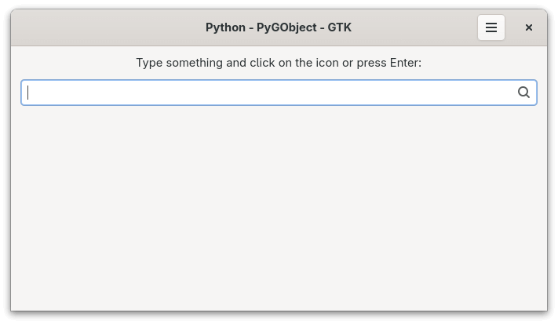

- [Python](./src/gtk-widgets/entry/MainWindow.py).
- [GTK Blueprint](./src/gtk-widgets/entry/ui).

---

#### Gtk.FileDialog (folder)

")

- [Python](./src/gtk-widgets/file-dialog-folder/MainWindow.py).
- [GTK Blueprint](./src/gtk-widgets/file-dialog-folder/ui).

---

#### Gtk.FileDialog (open)

")

- [Python](/src/gtk-widgets/file-dialog-open/MainWindow.py).
- [GTK Blueprint](/src/gtk-widgets/file-dialog-open/ui).

---

#### Gtk.FileDialog (save)

")

- [Python](./src/gtk-widgets/file-dialog-save/MainWindow.py).
- [GTK Blueprint](./src/gtk-widgets/file-dialog-save/ui).

---

#### Gtk.Fixed

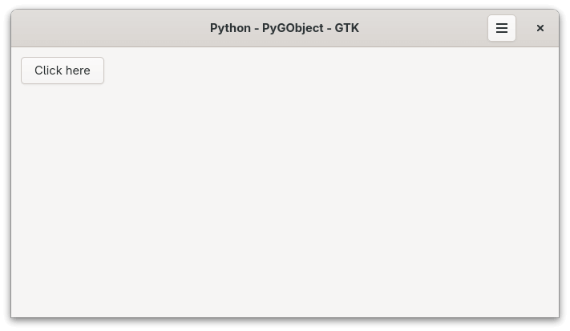

- [Python](./src/gtk-widgets/fixed/MainWindow.py).
- [GTK Blueprint](./src/gtk-widgets/fixed/ui).

---

#### Gtk.FlowBox

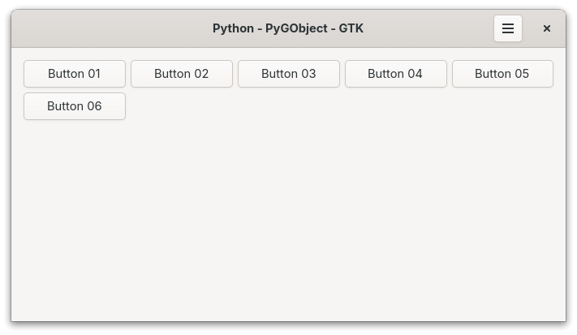

- [Python](./src/gtk-widgets/flow-box/MainWindow.py).
- [GTK Blueprint](./src/gtk-widgets/flow-box/ui).

---

#### Gtk.Grid

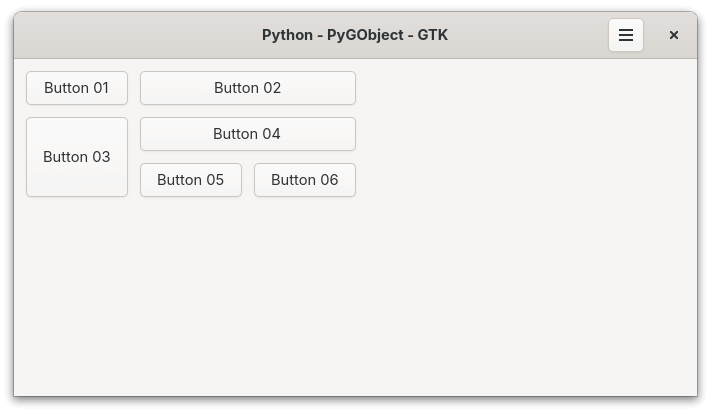

- [Python](./src/gtk-widgets/grid/MainWindow.py).
- [GTK Blueprint](./src/gtk-widgets/grid/ui).

---

#### Gtk.HeaderBar

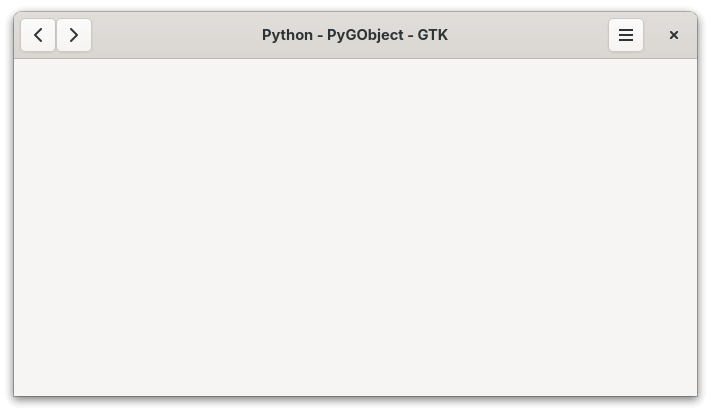

- [Python](./src/gtk-widgets/header-bar/MainWindow.py).
- [GTK Blueprint](./src/gtk-widgets/header-bar/ui).

---

#### Gtk.Image

- [Python](./src/gtk-widgets/image/MainWindow.py).
- [GTK Blueprint](./src/gtk-widgets/image/ui).

---

#### Gtk.ListBox

- [Python](./src/gtk-widgets/list-box/MainWindow.py).
- [GTK Blueprint](./src/gtk-widgets/list-box/ui).

---

#### Gtk.ListView

- [Python](./src/gtk-widgets/list-view/MainWindow.py).
- [GTK Blueprint](./src/gtk-widgets/list-view/ui).

---

#### Gtk.MenuButton

- [Python](./src/gtk-widgets/menu-button/MainWindow.py).
- [GTK Blueprint](./src/gtk-widgets/menu-button/ui).

---

#### Gtk.Overlay

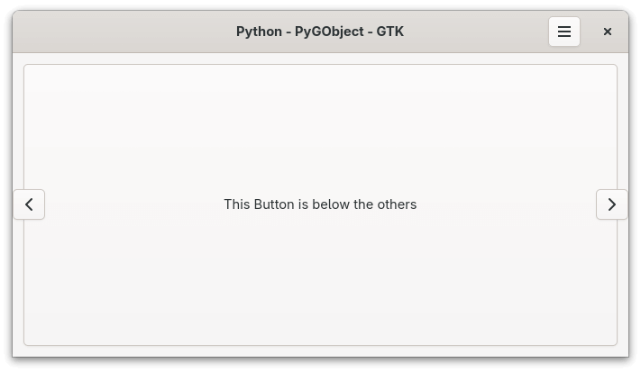

- [Python](./src/gtk-widgets/overlay/MainWindow.py).
- [GTK Blueprint](./src/gtk-widgets/overlay/ui).

---

Pango tags
==========

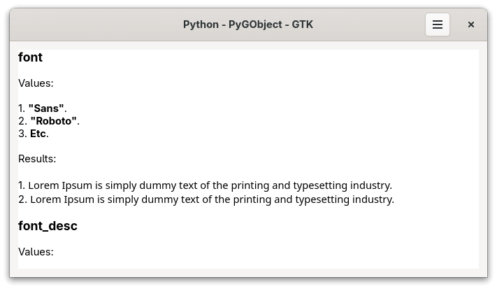

- [Python](./src/gtk-widgets/pango-tags/MainWindow.py).
- [GTK Blueprint](./src/gtk-widgets/pango-tags/ui).

---

#### Gtk.Picture

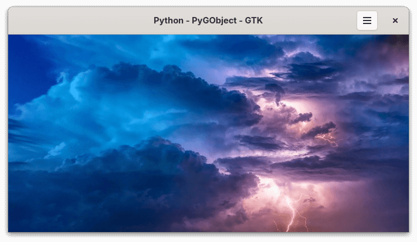

- [Python](./src/gtk-widgets/picture/MainWindow.py).
- [GTK Blueprint](./src/gtk-widgets/picture/ui).

---

#### Gtk.PrintOperation

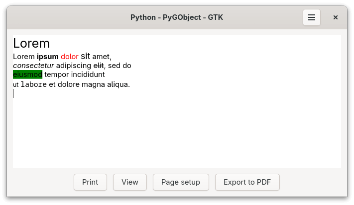

- [Python](./src/gtk-widgets/print-operation/MainWindow.py).
- [GTK Blueprint](./src/gtk-widgets/print-operation/ui).

---

#### Gtk.SearchBar

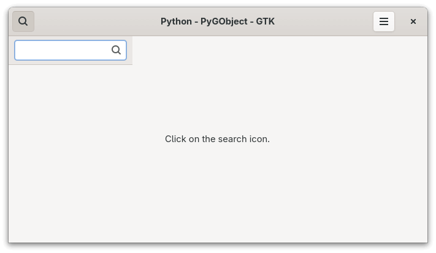

- [Python](./src/gtk-widgets/search-bar/MainWindow.py).
- [GTK Blueprint](./src/gtk-widgets/search-bar/ui).

---

#### Gtk.StackSidebar

- [Python](./src/gtk-widgets/stack-sidebar/MainWindow.py).
- [GTK Blueprint](./src/gtk-widgets/stack-sidebar/ui).

---

#### Gtk.StackSwitcher

- [Python](./src/gtk-widgets/stack-switcher/MainWindow.py).
- [GTK Blueprint](./src/gtk-widgets/stack-switcher/ui).

---

#### Gtk.Switch

- [Python](./src/gtk-widgets/switch/MainWindow.py).
- [GTK Blueprint](./src/gtk-widgets/switch/ui).

---

#### Translation (gettext)

")

- [Python](./src/gtk-widgets/translation-gettext/MainWindow.py).
- [GTK Blueprint](./src/gtk-widgets/translation-gettext/ui).

---

#### Gtk.Video

- [Python](./src/gtk-widgets/video/MainWindow.py).
- [GTK Blueprint](./src/gtk-widgets/video/ui).

---

#### Gtk.Window

- [Python](./src/gtk-widgets/window/MainWindow.py).
- [GTK Blueprint](./src/gtk-widgets/window/ui).

---

 

### Libadwaita

#### Adw.AboutDialog

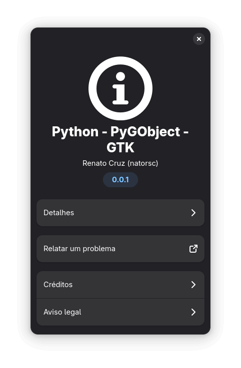

- [Python](./src/libadwaita-widgets/about-dialog/MainWindow.py).
- [GTK Blueprint](./src/libadwaita-widgets/about-dialog/ui).

---

#### Adw.ActionRow

- [Python](./src/libadwaita-widgets/action-row/MainWindow.py).
- [GTK Blueprint](./src/libadwaita-widgets/action-row/ui).

---

#### Adw.ApplicationWindow

- [Python](./src/libadwaita-widgets/application-window/MainWindow.py).
- [GTK Blueprint](./src/libadwaita-widgets/application-window/ui).

---

#### Adw.Avatar

- [Python](./src/libadwaita-widgets/avatar/MainWindow.py).
- [GTK Blueprint](./src/libadwaita-widgets/avatar/ui).

---

#### Adw.Banner

- [Python](./src/libadwaita-widgets/banner/MainWindow.py).
- [GTK Blueprint](./src/libadwaita-widgets/banner/ui).

---

#### Adw.ButtonContent

- [Python](./src/libadwaita-widgets/button-content/MainWindow.py).
- [GTK Blueprint](./src/libadwaita-widgets/button-content/ui).

---

#### Adw.Carousel

- [Python](./src/libadwaita-widgets/carousel/MainWindow.py).
- [GTK Blueprint](./src/libadwaita-widgets/carousel/ui).

---

#### Adw.CarouselIndicatorDots

- [Python](./src/libadwaita-widgets/carousel-indicator-dots/MainWindow.py).
- [GTK Blueprint](./src/libadwaita-widgets/carousel-indicator-dots/ui).

---

#### Adw.CarouselIndicatorLines

- [Python](./src/libadwaita-widgets/carousel-indicator-lines/MainWindow.py).
- [GTK Blueprint](./src/libadwaita-widgets/carousel-indicator-lines/ui).

---

#### Adw.Clamp

- [Python](./src/libadwaita-widgets/clamp/MainWindow.py).
- [GTK Blueprint](./src/libadwaita-widgets/clamp/ui).

---

#### Adw.ComboRow

- [Python](./src/libadwaita-widgets/combo-row/MainWindow.py).
- [GTK Blueprint](./src/libadwaita-widgets/combo-row/ui).

---

#### Adw.EntryRow

- [Python](./src/libadwaita-widgets/entry-row/MainWindow.py).
- [GTK Blueprint](./src/libadwaita-widgets/entry-row/ui).

---

#### Adw.ExpanderRow

- [Python](./src/libadwaita-widgets/expander-row/MainWindow.py).
- [GTK Blueprint](./src/libadwaita-widgets/expander-row/ui).

---

#### Adw.NavigationSplitView

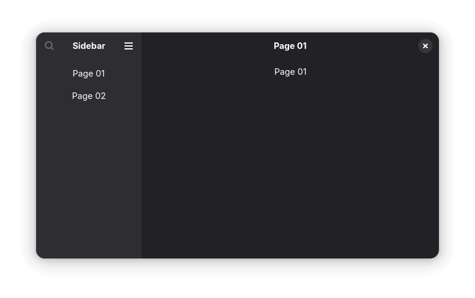

- [Python](./src/libadwaita-widgets/navigation-split-view/MainWindow.py).
- [GTK Blueprint](./src/libadwaita-widgets/navigation-split-view/ui).

---

#### Adw.NavigationView

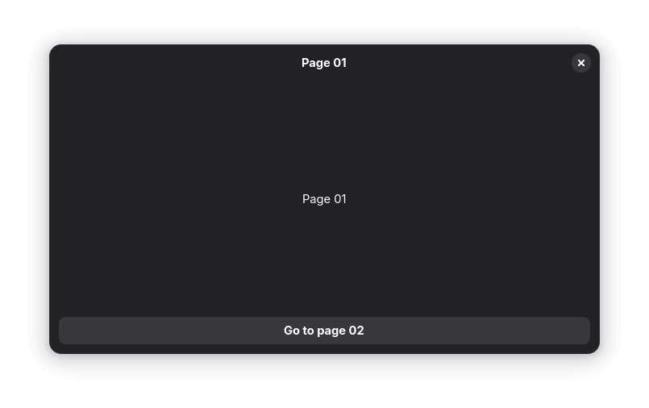

- [Python](./src/libadwaita-widgets/navigation-view/MainWindow.py).
- [GTK Blueprint](./src/libadwaita-widgets/navigation-view/ui).

---

#### Adw.PasswordEntryRow

- [Python](./src/libadwaita-widgets/password-entry-row/MainWindow.py).
- [GTK Blueprint](./src/libadwaita-widgets/password-entry-row/ui).

---

#### Adw.PreferencesPage

- [Python](./src/libadwaita-widgets/preferences-page/MainWindow.py).
- [GTK Blueprint](./src/libadwaita-widgets/preferences-page/ui).

---

#### Adw.SplitButton

- [Python](./src/libadwaita-widgets/split-button/MainWindow.py).
- [GTK Blueprint](./src/libadwaita-widgets/split-button/ui).

---

#### Adw.StatusPage

- [Python](./src/libadwaita-widgets/status-page/MainWindow.py).
- [GTK Blueprint](./src/libadwaita-widgets/status-page/ui).

---

#### Adw.ToastOverlay

- [Python](./src/libadwaita-widgets/toast-overlay/MainWindow.py).
- [GTK Blueprint](./src/libadwaita-widgets/toast-overlay/ui).

---

#### Adw.ViewSwitcherBar

- [Python](./src/libadwaita-widgets/view-switcher-bar/MainWindow.py).
- [GTK Blueprint](./src/libadwaita-widgets/view-switcher-bar/ui).
