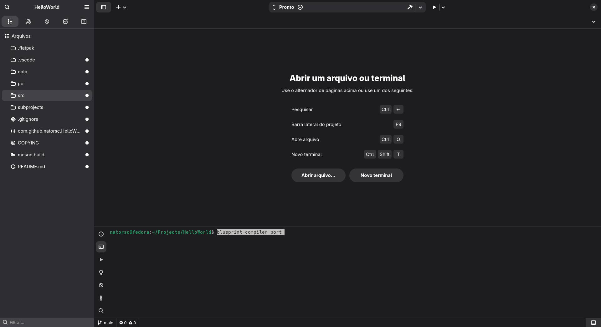

# How to Set Up the Blueprint Markup Language in Gnome Builder

Open the Gnome Builder terminal at the root of your project and run the command `blueprint-compiler port`:



In the `./src/meson.build` file, create the variable `blueprints`:

```bash
blueprints = custom_target('blueprints',
  input: files(
    'shortcuts-dialog.blp',
    'window.blp',
  ),
  output: '.',
  command: [find_program('blueprint-compiler'), 'batch-compile', '@OUTPUT@', '@CURRENT_SOURCE_DIR@', '@INPUT@'],
)
```


> After completing this configuration, save the file and press **Enter** in the terminal to continue the setup process.

Now, in the `gnome.compile_resources()` variable, add `dependencies: blueprints`:


> Again, save the file and press **Enter** in the terminal.

For the next steps, review what’s displayed in the terminal and proceed according to your project’s needs:

```bash
STEP 5: Update POTFILES.in
Will make the following changes to po/POTFILES.in
--- 
+++ 
@@ -5,4 +5,4 @@
 data/com.github.natorsc.HelloWorld.gschema.xml
 src/main.py
 src/window.py
-src/window.ui
+src/window.blp

Is this ok? [y/n] y
```

```
STEP 6: Clean up
Delete old XML files? [y/n] y
```
