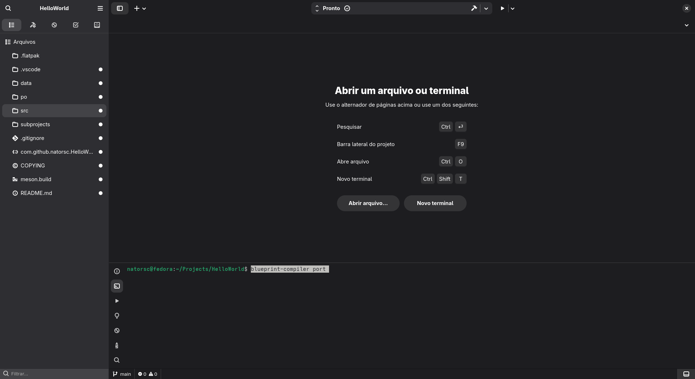
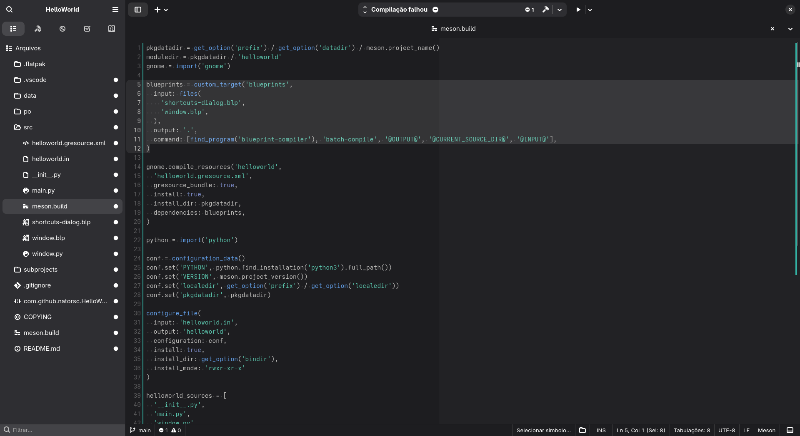
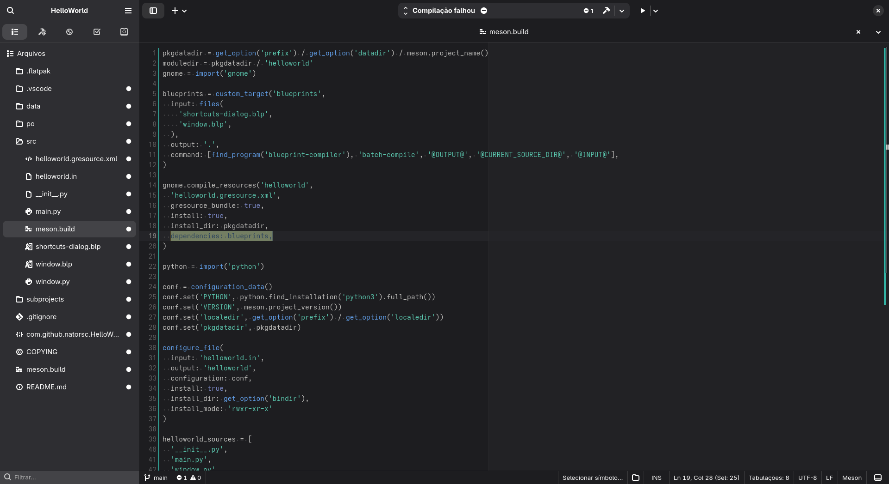

# Como configurar a linguagem de marcação Blueprint no Gnome Builder

Abrar o terminal do Gnome Builder na raíz do projeto e execute o comando `blueprint-compiler port`:



No arquivo `./src/meson.build` crie a variável `blueprints`:

```bash
blueprints = custom_target('blueprints',
  input: files(
    'shortcuts-dialog.blp',
    'window.blp',
  ),
  output: '.',
  command: [find_program('blueprint-compiler'), 'batch-compile', '@OUTPUT@', '@CURRENT_SOURCE_DIR@', '@INPUT@'],
)
```



> Ao finalizar a configuração salve o arquivo e pressione enter no terminal para continuar com as configuração.

Agora na variável `gnome.compile_resources()` adicione `dependencies: blueprints`:



> Novamente salve o arquivo e pressione enter no terminal.

Para os proximos passos analise o que é exibido no terminal e avance conforme as suas necessidades:

```bash
STEP 5: Update POTFILES.in
Will make the following changes to po/POTFILES.in
--- 
+++ 
@@ -5,4 +5,4 @@
 data/com.github.natorsc.HelloWorld.gschema.xml
 src/main.py
 src/window.py
-src/window.ui
+src/window.blp

Is this ok? [y/n] y
```

```
STEP 6: Clean up
Delete old XML files? [y/n] y
```
